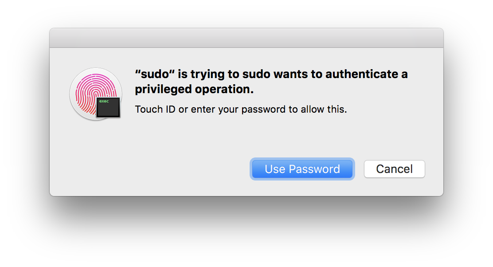

# sudo-touchid
`sudo-touchid` is a fork of `sudo` with Touch ID support on macOS (powered by the `LocalAuthentication` framework). Once compiled, it will allow you to authenticate `sudo` commands with Touch ID in the Terminal on supported Macs (such as the late 2016 MacBook Pros).

Since Darwin sources for macOS 10.12 are not available yet, this project is based on `sudo` sources corresponding to OS X 10.11.6 and obtained from [opensource.apple.com](http://opensource.apple.com).

## Screenshot

## Warning

Only tested under the MacBook Pro with Touch Bar, macOS 10.12.1.

## Building

To build `sudo-touchid`, simply open the included Xcode project file with Xcode 8+, select the `Build All` target, and click **Build**.

## Running

If we try running our newly-built `sudo` executable now, we'll get an error:

> sudo must be owned by uid 0 and have the setuid bit set

To fix this, we can use our system's `sudo` command and the `chown/chmod` commands to give our newly-built `sudo` the permissions it needs:

> cd (built-products-directory)

> sudo chown root:wheel sudo && sudo chmod 4755 sudo

Now if we try running our copy of `sudo`, it should work:

> cd (built-products-directory)

> ./sudo -s

## Installing

Replacing the system's `sudo` program is quite risky (can prevent your Mac from booting) and requires disabling System Integrity Protection (aka "Rootless").

Instead of replacing `sudo`, we can install our build under `/usr/local/bin` and give the path precedence over `/usr/bin`, this way our build is found first.

> sudo cp (built-products-directory)/sudo /usr/local/bin/sudo

> sudo chown root:wheel /usr/local/bin/sudo && sudo chmod 4755 /usr/local/bin/sudo

You can set up your `PATH` by adding `export PATH=/usr/local/bin:$PATH` to `.bashrc` (thanks @edenzik).

Now you should be able to enter `sudo` in any Terminal (or iTerm) window and authenticate with Touch ID!
